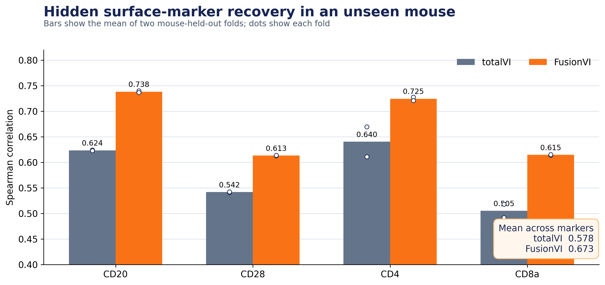

# FusionVI

FusionVI is a focused comparison with the original totalVI method on the
official SLN111 CITE-seq dataset used in the totalVI paper.

## Biological question

Can RNA and the remaining surface-protein panel recover the abundance of a
missing immune-cell marker in a biological replicate that the model has never
seen?

The four hidden markers have distinct biological roles:

- **CD20 / Ms4a1:** B-cell identity and a therapeutic target.
- **CD28 / Cd28:** T-cell costimulation and immune activation.
- **CD4 / Cd4:** helper-T-cell lineage.
- **CD8a / Cd8a:** cytotoxic-T-cell lineage.

Recovering these proteins tests whether a multimodal model can preserve immune
cell identity when a clinically relevant surface measurement is unavailable.

## Models compared

Only two final models are reported.

### totalVI

The baseline follows the paper's joint RNA-protein encoder and native
generative protein decoder. The four evaluation proteins are masked at encoder
input so totalVI must infer them from the other measurements.

### FusionVI

FusionVI replaces the joint encoder with separate RNA and protein branches. A
cell-specific gate combines their hidden states. The final prediction uses the
FusionVI latent state, the remaining 106 proteins and the prespecified matching
transcript in a fixed Ridge readout. The same four proteins are excluded from
all prediction inputs.

## Data and study design

The checksum-verified `spleen_lymph_111.h5ad` file comes from the official
totalVI reproducibility repository associated with Gayoso et al., *Nature
Methods* (2021), accession GSE150599.

- 16,813 non-negative cells after filtering
- 4,000 highly variable genes
- 110 biological proteins after removing hashtag controls
- two biological replicate mice
- spleen and lymph-node samples from each mouse
- two-fold leave-one-mouse-out evaluation
- 25 training epochs per model and fold

Each direction trains on one mouse and evaluates the other. This prevents cells
from the same mouse appearing in both training and test data.

## Results

| Hidden protein | totalVI | FusionVI | Difference |
|---|---:|---:|---:|
| CD20 | 0.624 | 0.738 | +0.115 |
| CD28 | 0.542 | 0.613 | +0.072 |
| CD4 | 0.640 | 0.725 | +0.084 |
| CD8a | 0.505 | 0.615 | +0.110 |
| **Mean** | **0.578** | **0.673** | **+0.095** |

Values are mean Spearman correlations across the two mouse-held-out folds.
FusionVI improved every hidden marker in both fold directions. CD20 and CD8a
showed the largest gains, consistent with the remaining protein panel carrying
strong lineage information that complements sparse marker-matched RNA.



## Interpretation

The experiment supports a technical conclusion: targeted cross-modal context
improves hidden surface-marker ranking in an unseen mouse relative to the
original totalVI decoder. The result is relevant to therapeutic biomarker and
target-panel design because CD20, CD28, CD4 and CD8a define drug-relevant immune
populations.

The dataset contains only two independent mice. Thousands of cells improve
prediction precision but do not create additional biological replicates.
Therefore, this project does not claim population-level generalization or
clinical utility.

## Reproduce

The executed environment used Python 3.12, scvi-tools 1.4.2, PyTorch 2.8.0 and
one CUDA GPU.

```powershell
python -m venv .venv
.\.venv\Scripts\python -m pip install -r requirements.txt
.\run_all.ps1
```

The script downloads and verifies the source object, prepares the analysis
matrix, trains totalVI and FusionVI in both mouse-held-out directions, evaluates
the hidden markers and regenerates the final figure. Completed folds are
detected and skipped.

## Repository layout

- `config/experiment.yaml` sets the seed, model size, training schedule and
  hidden markers.
- `src/download_data.py` downloads the official dataset and verifies SHA-256.
- `src/prepare_data.py` filters cells, selects genes and removes hashtag
  controls.
- `src/fusionvi.py` contains the masked totalVI encoder and FusionVI dual-branch
  encoder.
- `src/train_fold.py` trains one model in one mouse-held-out direction.
- `src/evaluate.py` fits the fixed FusionVI readout and computes both models'
  held-out correlations.
- `src/make_figure.py` regenerates the final comparison figure.
- `results/` contains compact metrics and figures.
- `deliverables/` contains the presentation and technical report.

Raw data, processed AnnData objects, fold-level latent arrays and model weights
are regenerated locally and excluded from Git.
