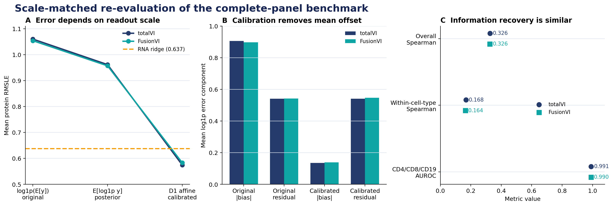

# FusionVI

FusionVI is an experimental encoder variant evaluated on the published
totalVI missing-protein benchmark, with explicit capacity and missingness
controls added after reanalysis.

## Question

Can RNA in a new CITE-seq batch recover an entire unmeasured surface-protein
panel, and does a modality-specific fusion encoder improve that recovery?

This problem matters for therapeutic biomarker studies because surface proteins
define immune populations and drug targets, yet antibody panels may fail or
differ across experiments.

## Controlled benchmark

The repository uses the official SLN111 object released with the totalVI paper:

- 16,828 cells
- 4,005 highly variable genes
- 110 biological proteins
- SLN111-D1 as the complete RNA-protein reference batch
- SLN111-D2 as the target batch with every protein hidden during training

The comparison fixes the data, 20-dimensional latent space, native totalVI
decoder and likelihoods, optimizer, validation split, training budget and
posterior prediction procedure. The original encoder variants differ in width
and library-size estimation; the new control arms isolate those differences.

### Models

- **totalVI:** the published joint RNA-protein encoder.
- **FusionVI:** separate RNA and protein branches combined by a learned
  cell-level gate, with an explicit RNA-only route when proteins are absent.

## Main result

Across 16 paired random initializations, FusionVI reached mean
per-protein RMSLE **1.0539** using the original
`log1p(E[y])` readout. It was lower than:

- the same-width joint encoder by **0.0106**
  (95% CI -0.0135 to -0.0077;
  15/16 seed wins);
- the parameter-matched joint encoder by **0.0189**
  (95% CI -0.0216 to -0.0162;
  16/16 wins); and
- the missingness-aware joint encoder by **0.0112**
  (95% CI -0.0143 to -0.0081;
  15/16 wins).

Against the published totalVI configuration, the difference was
-0.0062 (95% CI -0.0086 to
-0.0038; 14/16 wins). Adding a missing-panel indicator to
the same-width joint encoder did not improve RMSLE (+0.0006;
p=0.51).

That readout does not target the same scale as RMSLE. Every checkpoint was
therefore re-scored without retraining using posterior `E[log1p y]` and a
per-protein affine calibration fitted only on D1 RNA-only predictions:

| Readout | totalVI | FusionVI | FusionVI − totalVI |
|---|---:|---:|---:|
| Original `log1p(E[y])` | 1.0600 | 1.0538 | -0.0062 |
| Posterior `E[log1p y]` | 0.9616 | 0.9569 | -0.0047 |
| D1-only calibrated | **0.5745** | 0.5831 | +0.0085 |
| RNA SVD-ridge | 0.6373 | — | — |

After calibration, FusionVI's RMSLE was numerically higher by
+0.0085 (95% CI
-0.0003 to +0.0173;
Holm p=0.218). FusionVI also
had higher residual error (+0.0065)
and lower within-cell-type Spearman (0.1640
versus 0.1681). Marker
AUROC was saturated for both models at approximately 0.99.

The evidence therefore supports a calibration result: FusionVI's original
RMSLE lead came mostly from output scale, not stronger recovery of biological
variation. D1 calibration also moved both neural models below the widened RNA
ridge RMSLE of 0.6373, showing that the old
ridge-versus-neural gap was likewise dominated by scale.

The paper used 30 initializations. This repository records that protocol but
runs 16 paired seeds for the course benchmark. The result supports a bounded
algorithmic comparison on one source-target batch pair; it does not establish
clinical or population-level biological generalization.



## Reproduce

The executed environment used Python 3.12, scvi-tools 1.4.2 and PyTorch 2.8.0
with one CUDA GPU.

```powershell
python -m venv .venv
.\.venv\Scripts\python -m pip install -r requirements.txt
.\run_paper_benchmark.ps1
.\run_controls.ps1 -Tier 1
python src\rna_baseline_paper_benchmark.py
.\run_calibration.ps1
python -m unittest discover -s tests -v
```

Completed runs are detected and skipped. The pipeline downloads and verifies
the source object, creates the paper-aligned missing-panel split, trains both
models under paired seeds, evaluates every protein and regenerates all compact
results, figures and reports.

## Repository structure

- `config/paper_benchmark.yaml`: fixed benchmark settings and paired seeds.
- `src/prepare_paper_benchmark.py`: creates the missing-panel analysis object.
- `src/train_paper_benchmark.py`: trains one model for one seed.
- `src/fusionvi.py`: totalVI-compatible, missingness-aware dual-branch encoder.
- `src/evaluate_paper_benchmark.py`: aggregates metrics and figures.
- `src/rna_baseline_paper_benchmark.py`: source-only tuned RNA ridge baseline.
- `src/evaluate_biological_metrics.py`: foreground, within-cell-type and marker-AUROC metrics.
- `src/evaluate_calibration.py`: scale-matched readouts, bias/residual decomposition and biological metrics.
- `src/plot_calibration.py`: final calibration benchmark figure.
- `src/plot_heldout_experiments.py`: neutral summary figures for Experiments 1--3.
- `src/stats_paper_benchmark.py`: seed-level confidence intervals and exact tests.
- `src/benchmark_arms.py`: capacity, missingness and gate control encoders.
- `run_controls.ps1`: resumable seed-major control benchmark.
- `CONTROLS.md`: control rationale and interpretation limits.
- `TECHNICAL_REPORT.md`: concise GitHub-readable report.
- `deliverables/`: final PowerPoint and Word report.
- `results/`: compact per-seed and per-protein results.

Raw data, model weights and regenerated intermediate arrays are excluded from
Git.

## Reference

Gayoso A, Steier Z, Lopez R, et al. Joint probabilistic modeling of single-cell
multi-omic data with totalVI. *Nature Methods*. 2021;18:272-282.
https://doi.org/10.1038/s41592-020-01050-x
