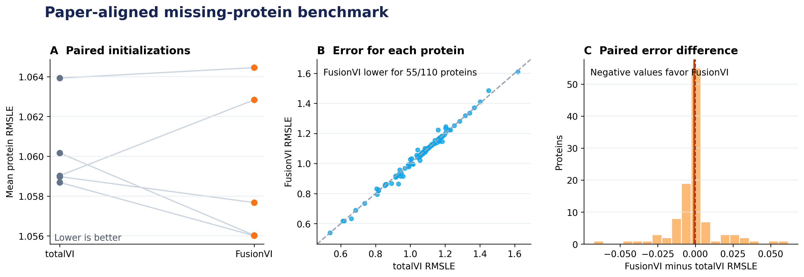

# FusionVI

FusionVI is an experimental encoder variant evaluated on the published
totalVI missing-protein benchmark, with explicit capacity and missingness
controls added after reanalysis.

## Question

Can RNA in a new CITE-seq batch recover an entire unmeasured surface-protein
panel, and does a modality-specific fusion encoder improve that recovery?

This problem matters for therapeutic biomarker studies because surface proteins
define immune populations and drug targets, yet antibody panels may fail or
differ across experiments.

## Controlled benchmark

The repository uses the official SLN111 object released with the totalVI paper:

- 16,828 cells
- 4,005 highly variable genes
- 110 biological proteins
- SLN111-D1 as the complete RNA-protein reference batch
- SLN111-D2 as the target batch with every protein hidden during training

The comparison fixes the data, 20-dimensional latent space, native totalVI
decoder and likelihoods, optimizer, validation split, training budget and
posterior prediction procedure. The original encoder variants differ in width
and library-size estimation; the new control arms isolate those differences.

### Models

- **totalVI:** the published joint RNA-protein encoder.
- **FusionVI:** separate RNA and protein branches combined by a learned
  cell-level gate, with an explicit RNA-only route when proteins are absent.

## Main result

Across 4 paired random initializations, mean per-protein RMSLE was
**1.0605 for totalVI** and **1.0544 for FusionVI**. FusionVI was
**0.0060 lower** on the primary metric and used
**35.0% fewer trainable parameters**. FusionVI had lower mean RMSLE
for **74 of 110 proteins**.

The seed-paired RMSLE difference was -0.0060
(95% t interval -0.0176 to +0.0056;
p=0.20). The interval includes zero. The earlier
protein-level p-value is descriptive because proteins are repeated outcomes
within each initialization.

The original comparison is also capacity-confounded: totalVI uses a 256-unit
joint encoder and a separate library encoder, while FusionVI uses 128-unit
branches and reuses the RNA branch for library size. The parameter reduction
therefore cannot be attributed to modality fusion. `run_controls.ps1` adds
same-width, parameter-matched and missing-panel-aware joint controls.

The paper used 30 initializations. This repository records that protocol but
runs 4 paired seeds for the course benchmark. The result supports a bounded
algorithmic comparison on one source-target batch pair; it does not establish
clinical or population-level biological generalization.



## Reproduce

The executed environment used Python 3.12, scvi-tools 1.4.2 and PyTorch 2.8.0
with one CUDA GPU.

```powershell
python -m venv .venv
.\.venv\Scripts\python -m pip install -r requirements.txt
.\run_paper_benchmark.ps1
.\run_controls.ps1 -Tier 1
```

Completed runs are detected and skipped. The pipeline downloads and verifies
the source object, creates the paper-aligned missing-panel split, trains both
models under paired seeds, evaluates every protein and regenerates all compact
results, figures and reports.

## Repository structure

- `config/paper_benchmark.yaml`: fixed benchmark settings and paired seeds.
- `src/prepare_paper_benchmark.py`: creates the missing-panel analysis object.
- `src/train_paper_benchmark.py`: trains one model for one seed.
- `src/fusionvi.py`: totalVI-compatible, missingness-aware dual-branch encoder.
- `src/evaluate_paper_benchmark.py`: aggregates metrics and figures.
- `src/stats_paper_benchmark.py`: seed-level confidence intervals and exact tests.
- `src/benchmark_arms.py`: capacity, missingness and gate control encoders.
- `run_controls.ps1`: resumable seed-major control benchmark.
- `CONTROLS.md`: control rationale and interpretation limits.
- `TECHNICAL_REPORT.md`: concise GitHub-readable report.
- `deliverables/`: final PowerPoint and Word report.
- `results/`: compact per-seed and per-protein results.

Raw data, model weights and regenerated intermediate arrays are excluded from
Git.

## Reference

Gayoso A, Steier Z, Lopez R, et al. Joint probabilistic modeling of single-cell
multi-omic data with totalVI. *Nature Methods*. 2021;18:272-282.
https://doi.org/10.1038/s41592-020-01050-x
