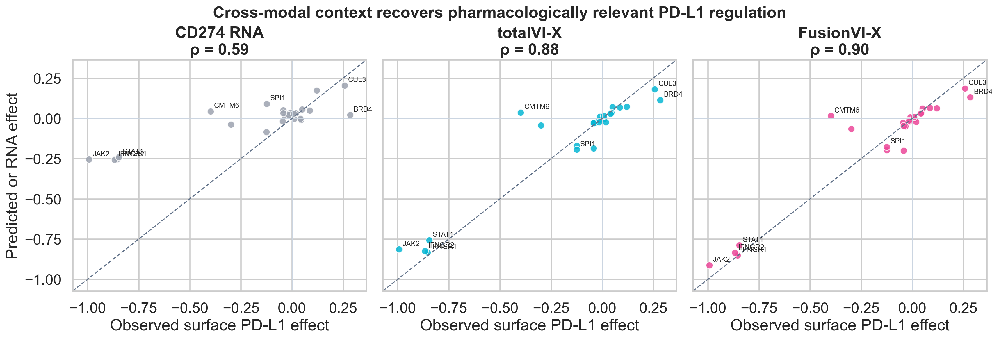

# FusionVI-X

FusionVI-X tests whether targeted cross-modal learning can recover hidden
therapeutic surface biomarkers from paired single-cell RNA and protein data.
It contains two complementary experiments:

1. **Lawlor PBMC stimulation:** can CD25, CD69 and HLA-DR be recovered in an
   unseen donor when RNA and protein disagree?
2. **Papalexi ECCITE-seq:** can surface PD-L1 responses be predicted for an
   entirely unseen CRISPR target after IFN-gamma stimulation?

Together they ask:

> When perturbation produces disagreement between transcript and surface-protein
> evidence, can cross-modal context recover pharmacodynamic biomarkers in an
> unseen donor or after an unseen molecular perturbation?

The study uses the Lawlor et al. PBMC CITE-seq experiment: 16,382 cells from 10
paired donors under baseline, LPS, or anti-CD3/CD28 stimulation, with 39 ADTs.
The external validation uses the Papalexi et al. ECCITE-seq screen: 20,729
IFN-gamma-treated THP-1 cells, 25 perturbed genes plus non-targeting controls,
three biological replicates and four surface proteins. PD-L1 is hidden at model
input and recovered from 2,000 RNA features plus CD86, PD-L2 and CD366.

## Method

The study contains two linked experiments.

**Encoder ablation.** FusionVI replaces totalVI's joint encoder with an RNA
branch, a protein branch and a learned scalar gate for every cell. The decoder,
likelihoods, latent size, training objective, preprocessing, seed and donor
splits remain fixed.

**Targeted cross-modal readout.** FusionVI-X predicts each hidden surface marker
from the FusionVI latent state, the remaining 36 ADTs and a prespecified
marker-matched RNA proxy. Ridge, histogram gradient boosting and Extra Trees are
candidate heads. Within each outer fold, the head family is selected by
three-fold grouped validation among the nine training donors, refit on those
nine donors, and evaluated once on the untouched tenth donor. Standard totalVI
receives the identical readout as a control (`totalVI-X`).

CD25, CD69 and HLA-DR are zeroed at encoder input and never used as readout
features. Their measured values are available only as training targets in the
nine training donors and as evaluation targets in the held-out donor. CD80 was
measured by external flow cytometry in the source paper but is absent from the
released 39-ADT matrix.

## Evaluation design

- **10-fold leave-one-donor-out validation**: each donor is the test set once.
- **Nested model selection**: readout family selected using training donors only.
- **Direct responses**: anti-CD3/CD28 T cells and LPS monocytes.
- **Held-out markers**: CD25/CD69 in T cells and HLA-DR in monocytes.
- **Discordance challenge**: marker RNA and measured protein percentile ranks
  differ by at least 0.50 within donor and relevant cell population.
- **Ablations**: RNA proxy, remaining ADTs, RNA+ADT context, totalVI-X and
  FusionVI-X.
- **Statistics**: one value per held-out donor, paired Wilcoxon tests, bootstrap
  confidence intervals and Benjamini-Hochberg correction.

Experiment 2 uses five outer folds. All cells targeting a CRISPR gene are kept
together, so every target is evaluated exactly once and is absent from that
fold's training set. Non-targeting cells are partitioned within replicate to
provide an untouched reference in every fold. Ridge versus Extra Trees is
selected through inner CRISPR-target-grouped validation. Final outcomes are
computed from 75 target-by-replicate effects rather than treating cells as
independent experiments.

## Executed results

For Experiment 1, all 20 neural runs completed at 40 epochs. Broad stimulation
labels were already at ceiling: standard totalVI achieved mean donor-held-out
ROC AUCs of 0.995 to 1.000. The scalar gate learned biological context but did
not reliably improve marker reconstruction by itself. Experiment 2 added ten
30-epoch neural runs: standard totalVI and FusionVI in each of five
target-held-out folds.

The nested cross-modal readout produced consistent positive results relative to
the standard totalVI decoder:

| Endpoint | totalVI | FusionVI-X | Paired difference | BH q |
|---|---:|---:|---:|---:|
| CD25 global Spearman | 0.779 | 0.825 | +0.046 | 0.0039 |
| CD69 global Spearman | 0.822 | 0.873 | +0.051 | 0.0039 |
| HLA-DR global Spearman | 0.404 | 0.756 | +0.352 | 0.0039 |
| HLA-DR discordant Spearman | -0.175 | 0.637 | +0.812 | 0.0117 |

Discordant CD25 and CD69 improvements were positive but not statistically
reliable. The ablation gives the biological interpretation: a marker-matched RNA
proxy alone became anticorrelated with surface abundance in discordant cells,
whereas the remaining surface-protein panel restored predictive signal. The
successful contribution is therefore targeted cross-modal biomarker readout;
the scalar gate is retained as an informative negative architecture ablation.

## Experiment 2: unseen CRISPR targets

The external validation supports the main result in a more direct therapeutic
setting:

| Model | PD-L1 effect Spearman | Direction accuracy |
|---|---:|---:|
| CD274 RNA only | 0.587 | 64.0% |
| totalVI decoder | 0.767 | 76.0% |
| totalVI-X | 0.841 | 82.7% |
| FusionVI decoder | 0.820 | 77.3% |
| **FusionVI-X** | **0.879** | **84.0%** |

Across the 25 held-out targets, FusionVI-X reduced median gene-level absolute
error by 0.0042 relative to totalVI-X (paired Wilcoxon p=0.042). This is a small
but consistent encoder contribution; most of the gain over native totalVI comes
from the target-safe cross-modal readout.

The predictions recover the expected loss of PD-L1 after perturbing JAK2,
IFNGR1, IFNGR2 or STAT1, and the increased PD-L1 after CUL3 or BRD4 perturbation.
The important negative result is CMTM6: surface PD-L1 decreases strongly while
CD274 RNA moves slightly upward, and FusionVI-X fails to recover that effect.
This provides a specific boundary condition for the model in a known
post-transcriptional PD-L1-stability mechanism.




## Reproduce

The executed environment used Python 3.12, scvi-tools 1.4.2, PyTorch 2.8.0 and
one CUDA GPU. From PowerShell:

```powershell
python -m venv .venv
.\.venv\Scripts\python -m pip install -r requirements.txt
.\run_all.ps1
```

`run_all.ps1` downloads checksum-verified matrices, prepares the AnnData objects,
runs both neural models, evaluates the nested readouts and regenerates every
result figure for both experiments. To run only the Papalexi validation:

```powershell
.\run_experiment2.ps1
```

## Repository layout

- `config/default.yaml` — fixed experiment configuration.
- `src/download_data.py` — HCA downloads with expected checksums.
- `src/prepare_data.py` — annotation matching, count preservation and
  lane-aware highly-variable-gene selection.
- `src/fusion_encoder.py` — masked totalVI and gated dual-branch encoders.
- `src/train_fold.py` — one deterministic donor-held-out neural fold.
- `src/classical_baselines.py` — donor-held-out PCA baselines.
- `src/evaluate.py` — biological metrics and donor-level inference.
- `src/cross_modal_head.py` — nested donor-safe cross-modal readout.
- `src/make_cross_modal_figures.py` — positive-result and ablation figures.
- `config/papalexi.yaml` — fixed external-validation configuration.
- `src/download_papalexi.py` — checksum-verified GEO download.
- `src/prepare_papalexi.py` — memory-bounded HVG selection and target folds.
- `src/train_papalexi_fold.py` — masked models trained by CRISPR-target fold.
- `src/evaluate_papalexi.py` — nested target-grouped effect analysis.
- `src/make_papalexi_figures.py` — external-validation figures.
- `results/` — compact metrics, selected head families and figures.
- `assets/papalexi_fig1a.png` — source-paper study-design panel used in the
  presentation, credited there to Papalexi et al., Nature Genetics 2021,
  Figure 1a.

Raw matrices, processed AnnData, model weights, per-cell fold outputs and
cross-modal cell-level predictions are regenerated and excluded from Git.

## Scope

This is an exploratory biomarker-recovery study. Experiment 1 is limited to one
dose and one 24-hour timepoint. Experiment 2 predicts held-out perturbations in
one stimulated cell line and therefore tests mechanism-level transfer rather
than patient-level generalization. Neither experiment establishes clinical
utility or prospective drug response.
