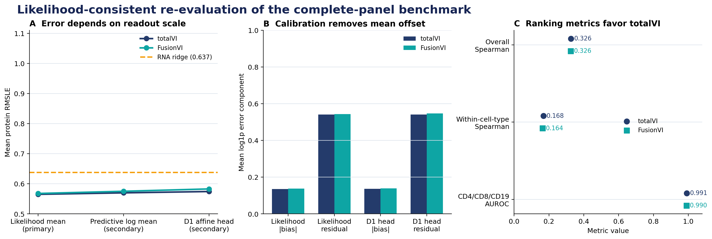
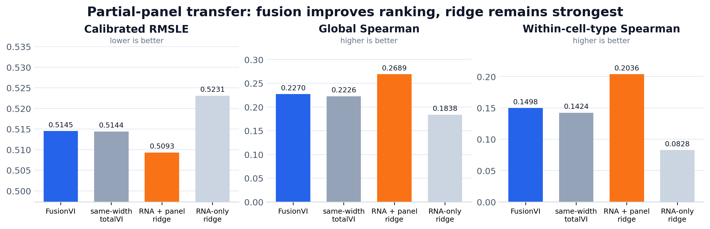

# FusionVI technical report

## Project question

Can modality-specific fusion improve recovery of therapeutic surface biomarkers when protein measurements are missing, discordant with RNA, or observed under an unseen perturbation?

FusionVI replaces totalVI's joint encoder with separate RNA and protein branches and a cell-level gate while retaining the totalVI decoder and likelihoods. The latest missing-panel version explicitly routes cells through the RNA branch when the complete protein panel is absent. Five experiments test different forms of generalization. In the complete-panel experiment, FusionVI had a small advantage under the original log1p-of-expected-count RMSLE, but the advantage disappeared after a D1-only scale calibration. In the original-paper SLN206 partial-panel experiment, where the target mouse retains 110 observed proteins and hides 97, FusionVI improved global and within-cell-type ranking over a same-width totalVI control in all four frozen seeds. Calibrated RMSLE was tied, and a simple RNA-plus-observed-panel ridge remained stronger.

## Experiment overview

| Experiment | Dataset and held-out unit | Biological question | Main result |
|---|---|---|---|
| 1. Donor-held-out activation | Lawlor PBMC CITE-seq; 10 donors | Can hidden CD25, CD69 and HLA-DR be recovered in an unseen donor, including RNA-protein-discordant cells? | Native encoders were close; a donor-safe cross-modal readout provided most of the gain. |
| 2. Unseen perturbations | Papalexi ECCITE-seq; 25 CRISPR targets | Given a held-out perturbation cell's RNA and three measured proteins, can its hidden PD-L1 response be recovered? | FusionVI-X achieved effect Spearman 0.879 and 84.0% direction accuracy. |
| 3. Targeted cross-mouse transfer | Original totalVI SLN111; 2 mice | Can four hidden immune markers be transferred to an unseen mouse? | A latent-free protein-context baseline reached 0.670; adding either latent changed Spearman by no more than 0.003. |
| 4. Complete missing panel | totalVI Figure 3 SLN111 design; 16 paired seeds | Can RNA recover all 110 proteins in a batch with no protein input? | FusionVI's raw RMSLE lead disappeared after source-only calibration; information-recovery metrics did not improve. |
| 5. Partial missing panel | Original totalVI SLN206; 4 frozen paired seeds | Can 110 observed proteins help recover 97 hidden biomarkers in an unseen mouse? | FusionVI improved ranking over same-width totalVI; calibrated RMSLE tied and ridge remained stronger. |

## Method

**Published baseline.** totalVI models RNA with a negative-binomial likelihood and proteins with a background-foreground mixture. Its standard encoder jointly processes both modalities.

**FusionVI encoder.** Separate RNA and protein branches produce modality-specific hidden representations. A learned gate combines them before estimating the same latent distribution used by the native totalVI decoder. For the complete missing-panel benchmark, an availability rule forces an RNA-only route when all protein inputs are absent, preventing an all-zero placeholder panel and encoder biases from creating a spurious protein representation.

**FusionVI-X readout.** Experiments 1 to 3 also evaluated a nested, leakage-safe cross-modal readout. It predicts a hidden protein from the learned latent state, the remaining proteins and a prespecified matching transcript. The same readout applied to totalVI is called totalVI-X. Native-decoder and X-readout results are reported separately because they answer different questions.

## Experiment 1 Lawlor donor-held-out activation

The Lawlor PBMC CITE-seq dataset contains 16,382 cells from 10 paired donors under baseline, LPS or anti-CD3/CD28 stimulation, with 4,000 genes and 39 antibody-derived tags. CD25 and CD69 were hidden in T cells and HLA-DR in monocytes. Every donor served once as the untouched outer test fold. Readout selection used only the other nine donors.

| Target | totalVI native | FusionVI native | totalVI-X | FusionVI-X |
|---|---:|---:|---:|---:|
| CD25 in T cells | 0.779 | 0.779 | 0.828 | 0.825 |
| CD69 in T cells | 0.822 | 0.826 | 0.874 | 0.873 |
| HLA-DR in monocytes | 0.404 | 0.421 | 0.743 | 0.756 |

The encoder change alone was a negative or near-null result. The cross-modal readout substantially improved hidden-marker recovery, but totalVI-X and FusionVI-X remained close. The ablation showed why multimodality matters: marker-matched RNA alone became misleading in discordant cells, whereas the remaining surface-protein panel restored useful signal.

## Experiment 2 Papalexi unseen CRISPR targets

The Papalexi ECCITE-seq screen contains 20,729 IFN-gamma-treated THP-1 cells, 25 perturbed genes, three biological replicates and four surface proteins. Five outer folds kept every cell from a CRISPR target together, so each target was evaluated only after being excluded from training. At test time, the model still receives each perturbed cell's RNA profile and the other three measured proteins; only PD-L1 is hidden. The perturbation-target label is not an input. This is therefore cross-modal PD-L1 completion in cells carrying unseen perturbations, rather than de novo response prediction from target identity. Outcomes were calculated from 75 target-by-replicate effects.

| Model | Effect Spearman | Direction accuracy | Effect MAE |
|---|---:|---:|---:|
| CD274 RNA only | 0.587 | 64.0% | — |
| totalVI decoder | 0.767 | 76.0% | — |
| FusionVI decoder | 0.820 | 77.3% | — |
| totalVI-X | 0.841 | 82.7% | 0.085 |
| FusionVI-X | **0.879** | **84.0%** | **0.081** |

FusionVI-X reduced median per-target PD-L1 effect absolute error by 0.0042 relative to totalVI-X after replicate averaging (paired Wilcoxon p=0.042, 25 targets). In a 5,000-sample target-cluster bootstrap, FusionVI-X effect Spearman was 0.879 (95% CI 0.728 to 0.967); its difference from totalVI-X was +0.038 (95% CI +0.011 to +0.083). The MAE-difference interval included zero (-0.011 to +0.003). It recovered the expected loss of PD-L1 after IFNGR1, IFNGR2, JAK2 and STAT1 perturbation and increased PD-L1 after CUL3 or BRD4 perturbation. It failed on CMTM6, where PD-L1 protein decreases despite slightly increased CD274 RNA. That failure is biologically informative because CMTM6 regulates PD-L1 stability after translation.

## Experiment 3 original totalVI targeted marker transfer

The official SLN111 object contains 16,813 mouse spleen and lymph-node cells, 4,000 genes and 110 proteins. CD20, CD28, CD4 and CD8a were masked together. Each model trained on one mouse and was evaluated on the other, then the direction was reversed.

| Readout | totalVI | FusionVI | Difference |
|---|---:|---:|---:|
| Native decoder mean Spearman | 0.578 | 0.589 | +0.012 |
| Fixed cross-modal readout mean Spearman | 0.671 | 0.673 | +0.001 |
| Latent-free protein context + RNA | 0.670 | 0.670 | shared baseline |

The native FusionVI decoder improved modestly, but the latent-free control changes the interpretation. The remaining 106 proteins plus the matching transcript reached 0.670; totalVI-X and FusionVI-X added only 0.002 and 0.003, respectively. Most cross-mouse performance came from measured protein context rather than either learned latent. Two mice support only a technical transfer conclusion.

## Experiment 4 paper-aligned complete missing panel

This experiment follows the totalVI paper's Figure 3 missing-protein test. SLN111-D1 retained RNA and all 110 proteins, while every D2 protein was hidden during training and preserved only for scoring. All neural models used the same 20-dimensional latent space, totalVI decoder and likelihoods, optimizer, split, 500-epoch budget and 25 posterior samples. Sixteen paired seeds were evaluated; the paper used 30 initializations.

The primary output is the likelihood-consistent expected protein count from `py_norm_`, including each checkpoint's learned per-protein efficiency. The efficiency-omitting helper output is retained only as an audit and is excluded from encoder claims.

| Encoder | Mean RMSLE | Overall Spearman | Within-cell-type Spearman |
|---|---:|---:|---:|
| Published totalVI | **0.5650** | 0.3262 | 0.1681 |
| Joint, same width | 0.5660 | **0.3294** | **0.1686** |
| Joint plus availability | 0.5662 | 0.3296 | 0.1673 |
| **FusionVI** | 0.5678 | 0.3256 | 0.1639 |
| Joint, parameter matched | 0.5698 | 0.3287 | 0.1593 |

FusionVI was worse than published totalVI by +0.0027 RMSLE (95% CI +0.0020 to +0.0035; 1/16 seed wins; Holm-adjusted p=2.6e-06). It was also worse than the same-width joint encoder by +0.0018 (95% CI +0.0008 to +0.0027; Holm p=0.00223) and worse than the availability-aware encoder by +0.0015 (95% CI +0.0008 to +0.0023; Holm p=0.00223). FusionVI beat only the smaller parameter-matched width-70 control by 0.0021 RMSLE (95% CI for FusionVI-minus-control -0.0030 to -0.0011; Holm p=0.00145).

The explicit availability indicator did not improve the same-width joint encoder: difference +0.0002 RMSLE (95% CI -0.0005 to +0.0010; Holm p=0.531).

FusionVI also did not recover stronger biological ranking. Its overall Spearman difference versus published totalVI was -0.0006 (95% CI -0.0013 to +0.0001; Holm p=0.176). Its within-cell-type Spearman was lower by 0.0042 versus published totalVI (95% CI -0.0059 to -0.0026; Holm p=0.00018) and lower by 0.0048 versus the same-width control (Holm p=8.6e-06).

The D1 affine head did not improve the neural models after the learned efficiency was restored: totalVI changed from 0.5650 to 0.5743, and FusionVI changed from 0.5678 to 0.5829. The historical helper output gave 1.0600 for totalVI and 1.0538 for FusionVI because it omitted the learned efficiency.

Likelihood-consistent totalVI therefore reproduces the paper's qualitative ordering and remains the best of the tested neural encoders on aggregate RMSLE. Experiment 4 is a negative result for FusionVI. The useful technical finding is that evaluating current scvi-tools protein imputations against observed counts requires the likelihood-consistent `py_norm_` readout.

## Experiment 5 original totalVI partial panel transfer

The official SLN206 object from the totalVI study contains 207 proteins. In target batch D2, the 110 proteins shared with the source panel remained available, while 97 target-only proteins were hidden and scored against their measured values. This design activates FusionVI's protein branch and tests cross-mouse biomarker completion rather than reconstruction from RNA alone. The model choice and evaluation plan were frozen on source-only development splits before D2 was evaluated. FusionVI and a same-width totalVI control then used the same 500-epoch budget for seeds 2026 to 2029. Calibration was fitted only on source cells routed through the corresponding missing-target pattern. Experiment 5 is unaffected by the Experiment 4 readout correction: positive per-protein efficiency scaling cannot change its per-protein Spearman metrics, and its D1 affine calibration absorbs the constant scale. Experiment 5 is unaffected by the Experiment 4 readout correction: positive per-protein efficiency scaling cannot change its per-protein Spearman metrics, and its D1 affine calibration absorbs the constant scale.

| Model | Calibrated RMSLE | Global Spearman | Within-cell-type Spearman |
|---|---:|---:|---:|
| FusionVI | 0.5145 | **0.2270** | **0.1498** |
| Same-width totalVI | **0.5144** | 0.2226 | 0.1424 |
| RNA + observed-panel ridge | **0.5093** | **0.2689** | **0.2036** |
| RNA-only ridge | 0.5231 | 0.1838 | 0.0828 |

FusionVI increased global Spearman by +0.0045 (95% CI +0.0032 to +0.0057; p=0.0016) and within-cell-type Spearman by +0.0074 (95% CI +0.0049 to +0.0098; p=0.0024). It won all four seeds on both metrics. Pearson correlation also increased by +0.0087, and residual standard deviation decreased by 0.0013. Calibrated RMSLE was effectively tied: the FusionVI-minus-totalVI difference was +0.0001 (95% CI -0.0017 to +0.0020).

The RNA-plus-observed-panel ridge remained the strongest method. The neural result therefore supports a specific architectural gain in ranking relative to same-width totalVI, rather than state-of-the-art performance on this task.

## Combined interpretation

The five experiments do not support a blanket claim that FusionVI is always superior. They support four narrower conclusions:

1. On the complete missing-panel benchmark, FusionVI does not improve correctly read totalVI. The initial apparent advantage came from the efficiency-omitting helper output; likelihood-consistent totalVI has lower RMSLE and stronger within-cell-type ranking.
2. For targeted cross-mouse marker recovery, measured protein context is more important than either learned latent representation.
3. Multimodal context improves prediction of unseen PD-L1 perturbation effects, but post-transcriptional mechanisms such as CMTM6 remain difficult when RNA and surface protein move in opposite directions.
4. When 110 proteins remain observed in the target mouse, FusionVI produces a small and consistent ranking gain over same-width totalVI, while a linear RNA-plus-panel baseline remains stronger.

These results are relevant to therapeutic discovery as a biomarker-completion and perturbation-ranking study. They do not establish clinical utility, patient-level generalization or replacement of prospective protein measurements.

## Reproducibility and limitations

- Experiment 1 uses 10 independent donors but one dose and one 24-hour timepoint.
- Experiment 2 uses one IFN-gamma-treated cell line; it tests mechanism-level transfer rather than patient response.
- Experiment 3 has only two mice and should be treated as a technical replication.
- Experiment 4 covers one source-target batch pair and 16 seeds rather than the paper's 30 initializations.
- Experiment 5 covers one source-target batch pair and four frozen paired seeds; the small seed count limits precision.
- Experiment 4 seed-level inference is primary; per-protein tests are descriptive repeated-outcome summaries.
- The original Experiment 4 comparison differs in encoder width and library-network design; the completed same-width, parameter-matched and missingness-aware controls address these prespecified confounders.
- Native-decoder and cross-modal-readout results are never pooled because they measure different contributions.
- Modality-dropout arms remain pending. Neural overall, within-cell-type and marker-AUROC metrics are complete for all 16 seeds and all Tier 0/1 arms.
- `results/calibration_summary_likelihood_correct.csv`, `calibration_contrasts_likelihood_correct.csv`, `calibration_within_celltype_likelihood_correct.csv` and `calibration_marker_auroc_likelihood_correct.csv` contain the likelihood-consistent Experiment 4 evaluation.
- `results/calibration_summary_sln206_partial.csv` and `calibration_contrasts_sln206_partial.csv` contain the frozen partial-panel evaluation.
- `results/fusionvi_experiments_summary.json` records the consolidated metrics used in this report.
- `run_paper_benchmark.ps1` reproduces the current full-panel benchmark. The original Lawlor and Papalexi training pipelines were not retained, so Experiments 1 and 2 are documented from their saved held-out predictions, metrics and figures and are not reproducible from a fresh clone. The versioned `papalexi_effects.csv` does reproduce the target-cluster bootstrap with `stats_heldout_experiments.py exp2`.

## References

1. Gayoso A, Steier Z, Lopez R, et al. Joint probabilistic modeling of single-cell multi-omic data with totalVI. *Nature Methods*. 2021;18:272–282. https://doi.org/10.1038/s41592-020-01050-x
2. Lawlor N, et al. Multiomic profiling identifies transcriptional and protein-level immune responses to stimulation. *Frontiers in Immunology*. 2021.
3. Papalexi E, et al. Mapping and analysis of perturbation responses in single cells by pooled CRISPR screening. *Nature Genetics*. 2021.
