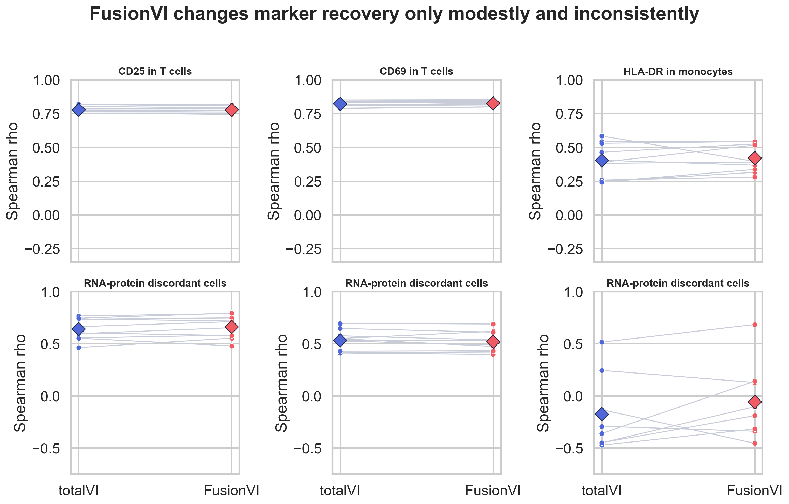
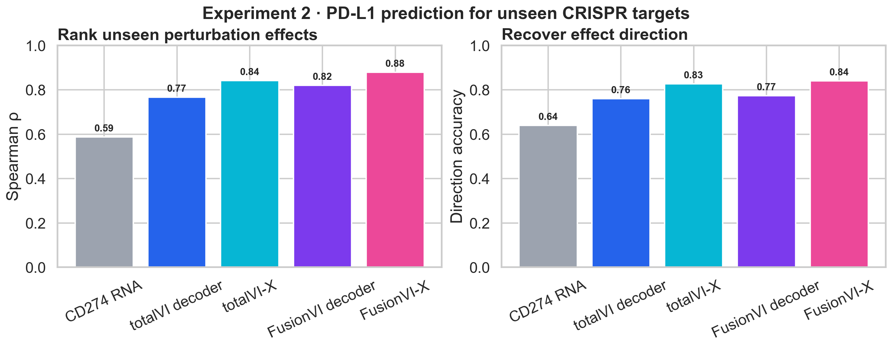
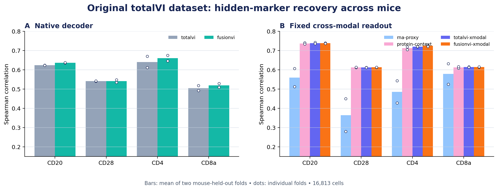

# FusionVI technical report

## Project question

Can modality-specific fusion improve recovery of therapeutic surface biomarkers when protein measurements are missing, discordant with RNA, or observed under an unseen perturbation?

FusionVI replaces totalVI's joint encoder with separate RNA and protein branches and a cell-level gate while retaining the totalVI decoder and likelihoods. The latest missing-panel version explicitly routes cells through the RNA branch when the complete protein panel is absent. Four experiments test different forms of generalization. Together, they show that FusionVI is most useful when the task exposes a real cross-modal or missingness challenge; improvements are small when a standard readout already captures the available structure.

## Experiment overview

| Experiment | Dataset and held-out unit | Biological question | Main result |
|---|---|---|---|
| 1. Donor-held-out activation | Lawlor PBMC CITE-seq; 10 donors | Can hidden CD25, CD69 and HLA-DR be recovered in an unseen donor, including RNA-protein-discordant cells? | Native encoders were close; a donor-safe cross-modal readout provided most of the gain. |
| 2. Unseen perturbations | Papalexi ECCITE-seq; 25 CRISPR targets | Can PD-L1 protein effects be predicted for a perturbation absent from training? | FusionVI-X achieved effect Spearman 0.879 and 84.0% direction accuracy. |
| 3. Targeted cross-mouse transfer | Original totalVI SLN111; 2 mice | Can four hidden immune markers be transferred to an unseen mouse? | Native FusionVI improved mean Spearman from 0.578 to 0.589; fixed cross-modal readouts were nearly tied. |
| 4. Complete missing panel | totalVI Figure 3 SLN111 design; 4 paired seeds | Can RNA recover all 110 proteins in a batch with no protein input? | FusionVI reduced RMSLE from 1.0605 to 1.0544. |

## Method

**Published baseline.** totalVI models RNA with a negative-binomial likelihood and proteins with a background-foreground mixture. Its standard encoder jointly processes both modalities.

**FusionVI encoder.** Separate RNA and protein branches produce modality-specific hidden representations. A learned gate combines them before estimating the same latent distribution used by the native totalVI decoder. For the complete missing-panel benchmark, an availability rule forces an RNA-only route when all protein inputs are absent, preventing an all-zero placeholder panel and encoder biases from creating a spurious protein representation.

**FusionVI-X readout.** Experiments 1 to 3 also evaluated a nested, leakage-safe cross-modal readout. It predicts a hidden protein from the learned latent state, the remaining proteins and a prespecified matching transcript. The same readout applied to totalVI is called totalVI-X. Native-decoder and X-readout results are reported separately because they answer different questions.

## Experiment 1 Lawlor donor-held-out activation

The Lawlor PBMC CITE-seq dataset contains 16,382 cells from 10 paired donors under baseline, LPS or anti-CD3/CD28 stimulation, with 4,000 genes and 39 antibody-derived tags. CD25 and CD69 were hidden in T cells and HLA-DR in monocytes. Every donor served once as the untouched outer test fold. Readout selection used only the other nine donors.

| Target | totalVI native | FusionVI native | totalVI-X | FusionVI-X |
|---|---:|---:|---:|---:|
| CD25 in T cells | 0.779 | 0.779 | 0.828 | 0.825 |
| CD69 in T cells | 0.822 | 0.826 | 0.874 | 0.873 |
| HLA-DR in monocytes | 0.404 | 0.421 | 0.743 | 0.756 |

The encoder change alone was a negative or near-null result. The cross-modal readout substantially improved hidden-marker recovery, but totalVI-X and FusionVI-X remained close. The ablation showed why multimodality matters: marker-matched RNA alone became misleading in discordant cells, whereas the remaining surface-protein panel restored useful signal.

## Experiment 2 Papalexi unseen CRISPR targets

The Papalexi ECCITE-seq screen contains 20,729 IFN-gamma-treated THP-1 cells, 25 perturbed genes, three biological replicates and four surface proteins. PD-L1 was hidden. Five outer folds kept every cell from a CRISPR target together, so each target was evaluated only after being excluded from training. Outcomes were calculated from 75 target-by-replicate effects.

| Model | Effect Spearman | Direction accuracy | Effect MAE |
|---|---:|---:|---:|
| CD274 RNA only | 0.587 | 64.0% | — |
| totalVI decoder | 0.767 | 76.0% | — |
| FusionVI decoder | 0.820 | 77.3% | — |
| totalVI-X | 0.841 | 82.7% | 0.085 |
| FusionVI-X | **0.879** | **84.0%** | **0.081** |

FusionVI-X reduced median gene-level absolute error by 0.0042 relative to totalVI-X (paired Wilcoxon p=0.042, 25 targets). It recovered the expected loss of PD-L1 after IFNGR1, IFNGR2, JAK2 and STAT1 perturbation and increased PD-L1 after CUL3 or BRD4 perturbation. It failed on CMTM6, where PD-L1 protein decreases despite slightly increased CD274 RNA. That failure is biologically informative because CMTM6 regulates PD-L1 stability after translation.

## Experiment 3 original totalVI targeted marker transfer

The official SLN111 object contains 16,813 mouse spleen and lymph-node cells, 4,000 genes and 110 proteins. CD20, CD28, CD4 and CD8a were masked together. Each model trained on one mouse and was evaluated on the other, then the direction was reversed.

| Readout | totalVI | FusionVI | Difference |
|---|---:|---:|---:|
| Native decoder mean Spearman | 0.578 | 0.589 | +0.012 |
| Fixed cross-modal readout mean Spearman | 0.671 | 0.673 | +0.001 |

The native FusionVI decoder improved modestly. FusionVI-X and totalVI-X were effectively tied, confirming that the fixed readout contributed most of the targeted-marker performance. Two mice support only a technical transfer conclusion.

## Experiment 4 paper-aligned complete missing panel

This experiment follows the totalVI paper's Figure 3 missing-protein test. SLN111-D1 retained RNA and all 110 proteins, while every D2 protein was hidden during training and preserved only for scoring. Both models used the same 20-dimensional latent space, native decoder and likelihoods, optimizer, split, 500-epoch budget and 25 posterior samples. Four paired seeds were run; the paper used 30.

| Metric | totalVI | FusionVI | Difference |
|---|---:|---:|---:|
| RMSLE primary | 1.0605 | **1.0544** | -0.0060 |
| Proteins with lower RMSLE | — | 74/110 | — |
| Trainable parameters | 4,574,975 | 2,971,904 | 35.0% fewer |

FusionVI reduced RMSLE by 0.57%. The paired protein-level Wilcoxon p-value was 1.04e-05; it is descriptive because proteins and random seeds are algorithmic benchmark units rather than independent biological cohorts. MAE also improved, while Spearman and Pearson correlations were slightly lower. The supported claim is therefore lower reconstruction error with fewer parameters.

## Combined interpretation

The four experiments do not support a blanket claim that FusionVI is always superior. They support three narrower conclusions:

1. Separating modality encoders can help when the test condition contains a real modality-availability shift, as in the complete missing-panel benchmark.
2. A leakage-safe cross-modal readout is more important than the encoder choice for targeted marker recovery when other proteins remain measured.
3. Multimodal context improves prediction of unseen PD-L1 perturbation effects, but post-transcriptional mechanisms such as CMTM6 remain difficult when RNA and surface protein move in opposite directions.

These results are relevant to therapeutic discovery as a biomarker-completion and perturbation-ranking study. They do not establish clinical utility, patient-level generalization or replacement of prospective protein measurements.

## Reproducibility and limitations

- Experiment 1 uses 10 independent donors but one dose and one 24-hour timepoint.
- Experiment 2 uses one IFN-gamma-treated cell line; it tests mechanism-level transfer rather than patient response.
- Experiment 3 has only two mice and should be treated as a technical replication.
- Experiment 4 covers one source-target batch pair and four seeds rather than the paper's 30 initializations.
- Native-decoder and cross-modal-readout results are never pooled because they measure different contributions.
- `results/fusionvi_experiments_summary.json` records the consolidated metrics used in this report.
- `run_paper_benchmark.ps1` reproduces the current full-panel benchmark. Historical experiment outputs remain traceable in the repository history.

## References

1. Gayoso A, Steier Z, Lopez R, et al. Joint probabilistic modeling of single-cell multi-omic data with totalVI. *Nature Methods*. 2021;18:272–282. https://doi.org/10.1038/s41592-020-01050-x
2. Lawlor N, et al. Multiomic profiling identifies transcriptional and protein-level immune responses to stimulation. *Frontiers in Immunology*. 2021.
3. Papalexi E, et al. Mapping and analysis of perturbation responses in single cells by pooled CRISPR screening. *Nature Genetics*. 2021.
