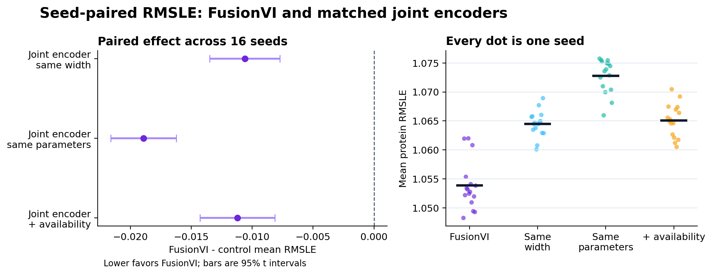

# FusionVI technical report

## Project question

Can modality-specific fusion improve recovery of therapeutic surface biomarkers when protein measurements are missing, discordant with RNA, or observed under an unseen perturbation?

FusionVI replaces totalVI's joint encoder with separate RNA and protein branches and a cell-level gate while retaining the totalVI decoder and likelihoods. The latest missing-panel version explicitly routes cells through the RNA branch when the complete protein panel is absent. Four experiments test different forms of generalization. In the complete-panel experiment, FusionVI retained a small RMSLE advantage over same-width, parameter-matched and missingness-aware joint encoders across 16 paired seeds. The advantage is algorithmically reproducible, although a simple RNA SVD-ridge model still performs substantially better on aggregate RMSLE.

## Experiment overview

| Experiment | Dataset and held-out unit | Biological question | Main result |
|---|---|---|---|
| 1. Donor-held-out activation | Lawlor PBMC CITE-seq; 10 donors | Can hidden CD25, CD69 and HLA-DR be recovered in an unseen donor, including RNA-protein-discordant cells? | Native encoders were close; a donor-safe cross-modal readout provided most of the gain. |
| 2. Unseen perturbations | Papalexi ECCITE-seq; 25 CRISPR targets | Given a held-out perturbation cell's RNA and three measured proteins, can its hidden PD-L1 response be recovered? | FusionVI-X achieved effect Spearman 0.879 and 84.0% direction accuracy. |
| 3. Targeted cross-mouse transfer | Original totalVI SLN111; 2 mice | Can four hidden immune markers be transferred to an unseen mouse? | A latent-free protein-context baseline reached 0.670; adding either latent changed Spearman by no more than 0.003. |
| 4. Complete missing panel | totalVI Figure 3 SLN111 design; 16 paired seeds | Can RNA recover all 110 proteins in a batch with no protein input? | FusionVI beat all three matched joint-encoder controls, but a source-only RNA ridge baseline remained substantially better. |

## Method

**Published baseline.** totalVI models RNA with a negative-binomial likelihood and proteins with a background-foreground mixture. Its standard encoder jointly processes both modalities.

**FusionVI encoder.** Separate RNA and protein branches produce modality-specific hidden representations. A learned gate combines them before estimating the same latent distribution used by the native totalVI decoder. For the complete missing-panel benchmark, an availability rule forces an RNA-only route when all protein inputs are absent, preventing an all-zero placeholder panel and encoder biases from creating a spurious protein representation.

**FusionVI-X readout.** Experiments 1 to 3 also evaluated a nested, leakage-safe cross-modal readout. It predicts a hidden protein from the learned latent state, the remaining proteins and a prespecified matching transcript. The same readout applied to totalVI is called totalVI-X. Native-decoder and X-readout results are reported separately because they answer different questions.

## Experiment 1 Lawlor donor-held-out activation

The Lawlor PBMC CITE-seq dataset contains 16,382 cells from 10 paired donors under baseline, LPS or anti-CD3/CD28 stimulation, with 4,000 genes and 39 antibody-derived tags. CD25 and CD69 were hidden in T cells and HLA-DR in monocytes. Every donor served once as the untouched outer test fold. Readout selection used only the other nine donors.

| Target | totalVI native | FusionVI native | totalVI-X | FusionVI-X |
|---|---:|---:|---:|---:|
| CD25 in T cells | 0.779 | 0.779 | 0.828 | 0.825 |
| CD69 in T cells | 0.822 | 0.826 | 0.874 | 0.873 |
| HLA-DR in monocytes | 0.404 | 0.421 | 0.743 | 0.756 |

The encoder change alone was a negative or near-null result. The cross-modal readout substantially improved hidden-marker recovery, but totalVI-X and FusionVI-X remained close. The ablation showed why multimodality matters: marker-matched RNA alone became misleading in discordant cells, whereas the remaining surface-protein panel restored useful signal.

## Experiment 2 Papalexi unseen CRISPR targets

The Papalexi ECCITE-seq screen contains 20,729 IFN-gamma-treated THP-1 cells, 25 perturbed genes, three biological replicates and four surface proteins. Five outer folds kept every cell from a CRISPR target together, so each target was evaluated only after being excluded from training. At test time, the model still receives each perturbed cell's RNA profile and the other three measured proteins; only PD-L1 is hidden. The perturbation-target label is not an input. This is therefore cross-modal PD-L1 completion in cells carrying unseen perturbations, rather than de novo response prediction from target identity. Outcomes were calculated from 75 target-by-replicate effects.

| Model | Effect Spearman | Direction accuracy | Effect MAE |
|---|---:|---:|---:|
| CD274 RNA only | 0.587 | 64.0% | — |
| totalVI decoder | 0.767 | 76.0% | — |
| FusionVI decoder | 0.820 | 77.3% | — |
| totalVI-X | 0.841 | 82.7% | 0.085 |
| FusionVI-X | **0.879** | **84.0%** | **0.081** |

FusionVI-X reduced median per-target PD-L1 effect absolute error by 0.0042 relative to totalVI-X after replicate averaging (paired Wilcoxon p=0.042, 25 targets). In a 5,000-sample target-cluster bootstrap, FusionVI-X effect Spearman was 0.879 (95% CI 0.728 to 0.967); its difference from totalVI-X was +0.038 (95% CI +0.011 to +0.083). The MAE-difference interval included zero (-0.011 to +0.003). It recovered the expected loss of PD-L1 after IFNGR1, IFNGR2, JAK2 and STAT1 perturbation and increased PD-L1 after CUL3 or BRD4 perturbation. It failed on CMTM6, where PD-L1 protein decreases despite slightly increased CD274 RNA. That failure is biologically informative because CMTM6 regulates PD-L1 stability after translation.

## Experiment 3 original totalVI targeted marker transfer

The official SLN111 object contains 16,813 mouse spleen and lymph-node cells, 4,000 genes and 110 proteins. CD20, CD28, CD4 and CD8a were masked together. Each model trained on one mouse and was evaluated on the other, then the direction was reversed.

| Readout | totalVI | FusionVI | Difference |
|---|---:|---:|---:|
| Native decoder mean Spearman | 0.578 | 0.589 | +0.012 |
| Fixed cross-modal readout mean Spearman | 0.671 | 0.673 | +0.001 |
| Latent-free protein context + RNA | 0.670 | 0.670 | shared baseline |

The native FusionVI decoder improved modestly, but the latent-free control changes the interpretation. The remaining 106 proteins plus the matching transcript reached 0.670; totalVI-X and FusionVI-X added only 0.002 and 0.003, respectively. Most cross-mouse performance came from measured protein context rather than either learned latent. Two mice support only a technical transfer conclusion.

## Experiment 4 paper-aligned complete missing panel

This experiment follows the totalVI paper's Figure 3 missing-protein test. SLN111-D1 retained RNA and all 110 proteins, while every D2 protein was hidden during training and preserved only for scoring. Every neural model used the same 20-dimensional latent space, native decoder and likelihoods, optimizer, split, 500-epoch budget and 25 posterior samples. Sixteen paired seeds were run; the paper used 30 initializations.

| Model | Encoder comparison | Mean RMSLE across 16 seeds | Difference versus FusionVI |
|---|---|---:|---:|
| FusionVI | Separate branches plus learned gate | **1.0539** | reference |
| totalVI | Published joint encoder, width 256 | 1.0601 | +0.0062 |
| Joint, same width | Width 128 | 1.0645 | +0.0106 |
| Joint, parameter matched | Width 70 | 1.0728 | +0.0189 |
| Joint plus availability | Width 128 plus missing-panel indicator | 1.0651 | +0.0112 |

The source-only RNA baseline fit a 128-component SVD and multi-output ridge on D1, selected its penalty using a D1 validation split, and then predicted D2. It reached mean protein RMSLE **0.6379**, well below every neural model. Its source-defined marker AUROCs were 0.976 for CD4, 0.990 for CD8 and 0.995 for CD19, while mean within-cell-type Spearman was only 0.169. This contrast shows why aggregate error and marker separation can look strong while within-cell-state variation remains difficult.

Random initialization is the valid replication unit. Against the same-width joint encoder, FusionVI reduced RMSLE by 0.0106 (95% CI -0.0135 to -0.0077; Holm-adjusted p=3.4e-06) and won 15/16 seeds. Against the parameter-matched joint encoder, the reduction was 0.0189 (95% CI -0.0216 to -0.0162; Holm-adjusted p=7.9e-10) with 16/16 wins. Against the missingness-aware joint encoder, the reduction was 0.0112 (95% CI -0.0143 to -0.0081; Holm-adjusted p=3.4e-06) with 15/16 wins. Adding the availability indicator to a same-width joint encoder did not help: difference +0.0006, 95% CI -0.0013 to +0.0025, p=0.51.

The original comparison was capacity-confounded because totalVI used width 256, FusionVI used width-128 branches and FusionVI reused its RNA branch for library size. The matched controls now show that FusionVI's small advantage is not explained by width, parameter count or the missing-panel indicator alone. Its absolute size remains modest, and the simple RNA baseline outperformed every neural model on the primary aggregate endpoint. Paired modality-dropout arms are implemented but were not required for the completed Tier 1 claim.

## Combined interpretation

The four experiments do not support a blanket claim that FusionVI is always superior. They support three narrower conclusions:

1. The complete missing-panel benchmark supports a small, reproducible FusionVI advantage over matched joint encoders across 16 paired seeds; the advantage remains much smaller than the gap between every neural model and the RNA SVD-ridge baseline.
2. For targeted cross-mouse marker recovery, measured protein context is more important than either learned latent representation.
3. Multimodal context improves prediction of unseen PD-L1 perturbation effects, but post-transcriptional mechanisms such as CMTM6 remain difficult when RNA and surface protein move in opposite directions.

These results are relevant to therapeutic discovery as a biomarker-completion and perturbation-ranking study. They do not establish clinical utility, patient-level generalization or replacement of prospective protein measurements.

## Reproducibility and limitations

- Experiment 1 uses 10 independent donors but one dose and one 24-hour timepoint.
- Experiment 2 uses one IFN-gamma-treated cell line; it tests mechanism-level transfer rather than patient response.
- Experiment 3 has only two mice and should be treated as a technical replication.
- Experiment 4 covers one source-target batch pair and 16 seeds rather than the paper's 30 initializations.
- Experiment 4 seed-level inference is primary; per-protein tests are descriptive repeated-outcome summaries.
- The original Experiment 4 comparison differs in encoder width and library-network design; the completed same-width, parameter-matched and missingness-aware controls address these prespecified confounders.
- Native-decoder and cross-modal-readout results are never pooled because they measure different contributions.
- Modality-dropout arms and neural-model foreground/cell-type metrics remain pending and are excluded from the completed Tier 1 conclusion.
- `results/fusionvi_experiments_summary.json` records the consolidated metrics used in this report.
- `run_paper_benchmark.ps1` reproduces the current full-panel benchmark. The original Lawlor and Papalexi training pipelines were not retained, so Experiments 1 and 2 are documented from their saved held-out predictions, metrics and figures and are not reproducible from a fresh clone. The versioned `papalexi_effects.csv` does reproduce the target-cluster bootstrap with `stats_heldout_experiments.py exp2`.

## References

1. Gayoso A, Steier Z, Lopez R, et al. Joint probabilistic modeling of single-cell multi-omic data with totalVI. *Nature Methods*. 2021;18:272–282. https://doi.org/10.1038/s41592-020-01050-x
2. Lawlor N, et al. Multiomic profiling identifies transcriptional and protein-level immune responses to stimulation. *Frontiers in Immunology*. 2021.
3. Papalexi E, et al. Mapping and analysis of perturbation responses in single cells by pooled CRISPR screening. *Nature Genetics*. 2021.
